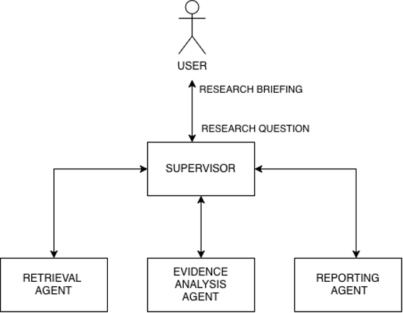
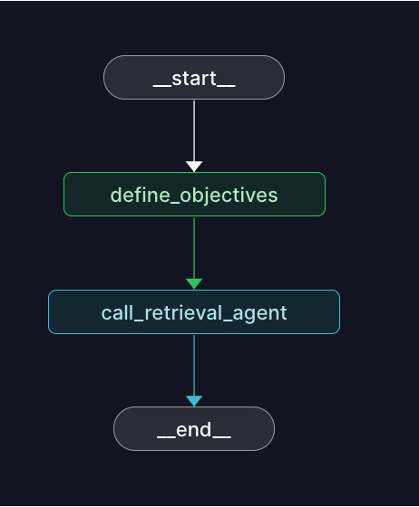
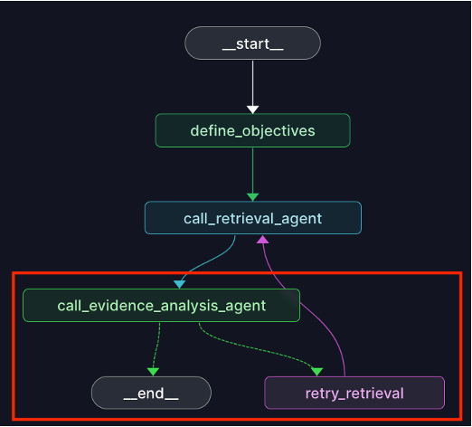
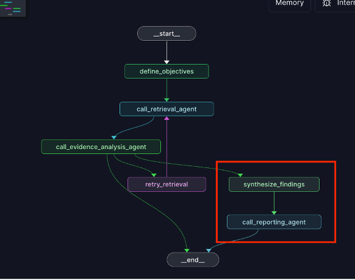

# Multi-Agent Academic Investigator

An intelligent multi-agent system for academic research. The system combines LLM-powered orchestration with LangGraph as its agent framework to interpret research questions, query academic database APIs, assess the reliability of gathered evidence, and produce an evidence-based research briefing.

## Features

- **LLM-powered orchestration** through a supervisor agent acting as a central coordinator that delegates tasks to specialized worker nodes and manage communication flow.
- **Fully autonomous sub-agents**, each with its own workflow and state.
- **Configurable agent behavior** through environment variables.
- **Explainable workflow decisions** through detailed logging.

## Prerequisites
- A minimum of 16GB of memory for qwen3:14b model (Song et al., 2025).
- Python 3.11+
- [Ollama](https://ollama.com) running locally. See [Install Ollama](#install-ollama).
- A Semantic Scholar API key (see [Environment variables](#environment-variables)).
- A LangSmith account (optional, only for tracing / the LangGraph Studio UI).

## Installation

```bash
python3 -m venv .venv
source .venv/bin/activate
pip install -e .
```

### Environment variables

Create a `.env` file in the repo root with your own values:

#### Academic database API KEY (Required)

```
# accepts a comma-separated list of keys for rate-limit rotation 
SEMANTIC_SCHOLAR_API_KEY=<your-semantic-scholar-api-key>[,<another-key>...]
```

You can use this value without quotes: 's2k-tGmv68Sl2blMwy1bx0JjGnfto3yjeFOg414UHTZX,s2k-wCyOT1Mra9x2FHyrtu63QY0rXS52K96YwIBeH4pm'

#### Automatic tracing using LangSmith (requires a LangSmith account) (Optional)

```
LANGSMITH_API_KEY=<your-langsmith-api-key>
LANGSMITH_TRACING=true
LANGSMITH_PROJECT=lang-graph-demo
```

For LangSmith setup see: [https://docs.langchain.com/langsmith/observability-quickstart](https://docs.langchain.com/langsmith/observability-quickstart)


### Install Ollama and model

Qwen3 14B excels at information extraction and structured data generation tasks (OCUL, 2026)

 1. Go to [https://ollama.com/download/](https://ollama.com/download/) and follow the instructions to install Ollama.
 2. Pull the model.
 ```bash
 ollama pull qwen3:14b
 ```


## Quick Start

Run directly with `src/main.py`, passing the research question as an argument:

```bash
python src/main.py "How does generative AI use among university students relate to their academic performance?"
```

Or run via the LangGraph CLI (see `langgraph.json`):

```bash
langgraph dev
```

This starts a local API server (default `http://127.0.0.1:2024`) and prints a
LangGraph Studio URL. Opening Studio requires logging into a (free)
smith.langchain.com account.

### Customize Agents' Behaviour

Use environment variables to customize agents' behaviour. All are optional; unset variables fall back to the defaults below.

- **NUM_RESEARCH_OBJECTIVES**: Number of research objectives the supervisor derives from the research question. Default: `1`.
- **NUM_SEARCH_DIMENSIONS**: Number of search dimensions (and therefore queries sent to the academic database API) the retrieval agent derives per objective. Each query returns one paper. Default: `2`.
- **MAX_PUBLICATION_AGE_YEARS**: Maximum age (in years, relative to the current year) a paper can have to count as recent evidence. Default: `3`.
- **MIN_REFERENCE_COUNT**: Minimum number of references a paper must have to be considered reliable. Default: `1`.
- **MIN_CITATION_COUNT**: Minimum number of citations a paper must have to be considered reliable. Default: `1`.

Set them either in your `.env` file:

```
NUM_RESEARCH_OBJECTIVES=2
NUM_SEARCH_DIMENSIONS=3
MAX_PUBLICATION_AGE_YEARS=5
MIN_REFERENCE_COUNT=5
MIN_CITATION_COUNT=10
```

or inline when running the entry point:

```bash
NUM_SEARCH_DIMENSIONS=3 MAX_PUBLICATION_AGE_YEARS=5 python src/main.py "How does generative AI use among university students relate to their academic performance?"
```

## Output

### Research briefing

All runs generate a research briefing in MS Word format (if gathered evidence is assessed reliable) in:

- target/research_briefing_*.docx

### Console Output

The system provides real-time progress updates of the workflow.

### Log Files

All runs generate:

- logs/run_output_*.log: Detailed workflow report.

## Architecture



## Agents

1. Supervisor: Defines research objectives from the research question (Creswell & Creswell, 2017), calls the retrieval and evidence-analysis sub-agents (retrying retrieval once if evidence isn't reliable), synthesizes findings, then hands off to the reporting agent.
2. Retrieval Agent: Breaks a request into search dimensions via the LLM, turns each into a Semantic Scholar query, and gathers papers.
3. Evidence Analysis Agent: Deterministically assesses each paper's reliability (recency/citation metrics, journal completeness, peer-reviewed type).
4. Reporting Agent: Turns the supervisor's structured insights into natural-language prose and writes the briefing to disk.

## Project layout

Root:
- `conftest.py` — root pytest fixture.
- `langgraph.json` — LangGraph CLI config.
- `pyproject.toml` — package metadata and dependencies
- `pytest.ini` — pytest config.

`src/agents/` — the four LangGraph agents:
- `supervisor.py` — Supervisor agent.
- `retrieval_agent.py` — Retrieval agent.
- `evidence_analysis_agent.py` —  Evidence Analysis agent.
- `reporting_agent.py` — Reporting agent.

`src/tools/`:
- `search_api.py` — Semantic Scholar search tool. handles paper/journal/author models and API-key rotation on rate limits.

`src/utils/`:
- `framework.py` — shared LangGraph plumbing and helpers used by the agents.

`src/main.py` — main entry point

`tests/` — pytest suite:
- `conftest.py` — fixture (local HTTP server) used by integration tests to avoid hitting the real Semantic Scholar API.
- `mockserver.py` — local HTTP server that replays canned Semantic Scholar responses for integration tests.
- `mock-response-reliable-paper.json`, `mock-response-unreliable-paper.json` — fixture payloads served by `mockserver.py`.
- `test_evidence_analysis_agent.py` — unit tests for the `assess_evidence_quality` tool.
- `test_manage_evidence_analysis.py` — unit tests for the full evidence-analysis graph (deterministic, no LLM).
- `test_reporting_agent_integration.py` — integration test that calls the real LLM to generate a briefing.
- `test_retrieval_agent.py` — unit tests for the retrieval agent's deterministic logic, with the LLM/search tool mocked.
- `test_retrieval_agent_integration.py` — integration test running the retrieval agent end-to-end against the mock Semantic Scholar server.
- `test_supervisor_integration.py` — integration test running the whole supervisor graph end-to-end.


## Iterative development

### [V1 - Capability](https://github.com/luitoz/multi-agent-academic-investigator/releases/tag/v1.0.0)

Can the system retrieve academic evidence?




### [V2 - Robustness](https://github.com/luitoz/multi-agent-academic-investigator/releases/tag/v2.0.0)

Can the system detect poor evidence and adapt its search?



### [V3 - Usability](https://github.com/luitoz/multi-agent-academic-investigator/releases/tag/v3.0.0)

Can the system transform evidence into a traceable research briefing?



## Running tests

Unit tests mock all LLM/agent calls, so they run without a live Ollama server.
Integration tests (marked `integration`) call the real model and are skipped
by default (see `addopts` in `pytest.ini`).

```bash
source .venv/bin/activate
pytest
```

Run a single file or test:

```bash
pytest tests/test_retrieval_agent.py
pytest tests/test_retrieval_agent.py::TestScheduleNode -v
```

Run the integration tests (requires a running Ollama server):

```bash
pytest -m integration tests/test_retrieval_agent_integration.py
pytest -m integration tests/test_supervisor_integration.py

```

Run all tests, including integration tests (requires a running Ollama server):

```bash
pytest -m "integration or not integration" -v
```

## References

- Creswell, J.W. and Creswell, J.D. (2017) Research Design: Qualitative, Quantitative, and Mixed Methods Approaches. SAGE Publications.
- Ontario Council of University Libraries (OCUL) (2026) ‘AI for Academic Libraries: Open-Weight AI Models for Local and Private Use’, Choice 360, 8 June. Available at: https://www.choice360.org/libtech-insight/ai-for-academic-libraries-open-weight-ai-models-for-local-and-private-use/ (Accessed: 3 October 2026).
- Song, Q. et al. (2025) ‘A Systematic Evaluation of On-Device LLMs: Quantization, Performance, and Resources’. arXiv. Available at: https://doi.org/10.48550/ARXIV.2505.15030.


